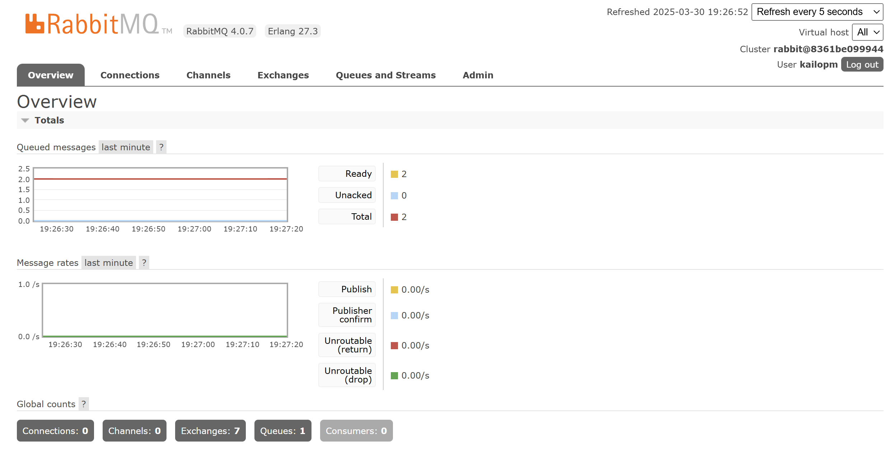
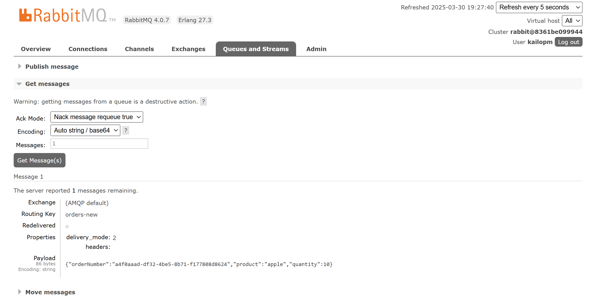

# RabbitMQ Simple App

## Table of Contents

- [About](#about)
- [Getting Started](#getting_started)
- [Usage](#usage)

## About <a name = "about"></a>

Sample application to demonstrate the RabbitMQ workflows with just a producer and consumer

## Getting Started <a name = "getting_started"></a>

These instructions will get you a copy of the project up and running on your local machine for development and testing purposes

### Prerequisites
1. NPM
2. Node.js
3. Docker
4. Docker-compose

## Installation <a name = "usage"></a>

```bash
npm init
npm install amqplib mysql uuid
docker-compose up -d --build
```

Create a phpMyAdmin table order

## Usage <a name = "usage"></a>

Access using the URL http://localhost:15672 (RabbitMQ)
Access using the URL http://localhost:15672 (phpMyAdmin)


```bash
node producer.js # Send object into the queue
```



```bash
node consumer.js # Send object into the database
```
